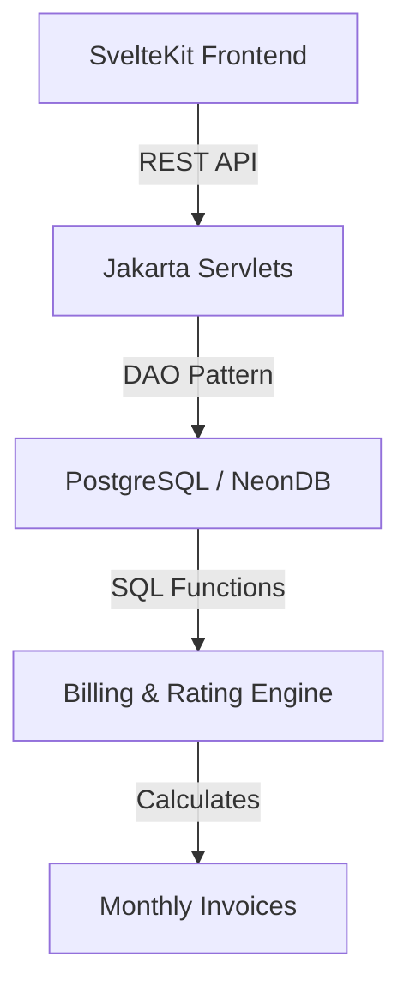

# FMRZ Telecom Billing System

[](https://www.oracle.com/java/)
[](https://kit.svelte.dev/)
[](https://maven.apache.org/)
[](https://www.postgresql.org/)

A unified telecommunications billing platform built with a **Jakarta EE** backend and a **SvelteKit** frontend. The system offloads complex billing math to a dedicated **PostgreSQL Rating Engine** for maximum performance and accuracy.

---

## 🏗️ System Architecture



---

## 🚀 Quick Start

> [!IMPORTANT]
> Ensure you have **Tomcat 11** installed. This project uses the `jakarta.*` namespace which is not compatible with older Tomcat versions.

### 1. Build the Unified Application
Run these commands in order to compile the frontend and package the backend.

```bash
# Build Frontend
cd frontend && npm install && npm run build && cd ..

# Build Backend
./mvnw clean package -DskipTests
```

### 2. Launch the Server
The project is pre-configured with the **Cargo Maven Plugin** for easy deployment.

```bash
# Clear any blocked ports first
pkill -f tomcat || true

# Start the application
./mvnw cargo:run
```

---

## 🛠️ Technology Stack

| Component | Technology | Version |
| :--- | :--- | :--- |
| **Runtime** | Java JDK | 21 |
| **Web Server** | Apache Tomcat | 11.0.x |
| **Servlet API** | Jakarta EE | 6.1 |
| **UI Framework** | SvelteKit | 2.0 |
| **Database** | PostgreSQL | 16+ |
| **Security** | BCrypt / Plain Text | Dev Mode |

---

## 📂 Project Structure

```text
├── src/main/java           # Jakarta Servlets and DAO Layer
├── src/main/webapp         # Compiled UI assets & Web Descriptor
├── frontend/               # SvelteKit Source Code
├── Billing_functions.sql   # SQL Stored Procedures (Billing Engine)
├── project-notes.txt       # Technical Audit & Roadmap
└── README.md               # System Documentation
```

---

## 🔐 Credentials (Development)

> [!NOTE]
> For the current development phase, authentication is handled in plain text.

- **URL:** `http://localhost:8080/Billing_system`
- **Admin Email:** `admin@fmrz.com`
- **Username:** `admin`
- **Password:** `admin123`

---

## 🛠️ Maintenance Commands

| Task | Command |
| :--- | :--- |
| **Database Recovery** | `./mvnw exec:java -Dexec.mainClass="com.billing.util.FixAdminPassword"` |
| **Force Build** | `./mvnw clean package` |
| **UI Development** | `cd frontend && npm run dev` |

---

© 2026 FMRZ Telecom Engineering Team. All Rights Reserved.